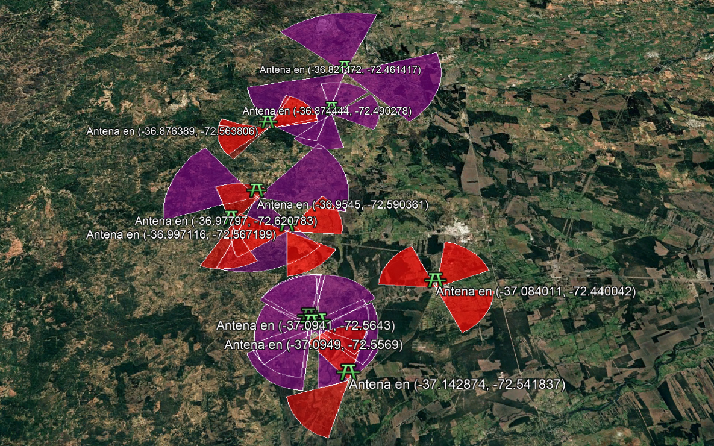

# SATT-Trafic-Phone
Sistema de Analisis de Trafico Telefonico

El Sistema de Análisis de Tráfico Telefónico (S.A.T.T.) es una herramienta diseñada para analizar tráfico telefónico a partir de registros proporcionados por las compañías de telecomunicaciones. Permite la detección de duplicados, análisis exhaustivo de números, análisis de IMEI y geolocalización de antenas. 

Idioma: Español. 
________________________________________
# Análisis de duplicados 
Objetivo:  
Identificar números de teléfonos que se repiten en múltiples sitios de interés.

Pasos:  
1.	Ingresar números en las casillas de "Sitio de Interés".
2.	Agregar o borrar columnas según necesidad.
3.	Hacer clic en "Analizar Duplicados" para buscar coincidencias.
4.	Exportar los resultados a Excel si es necesario.

________________________________________
# Análisis de exhaustivo 
Objetivo:
Obtener la información detallada y específica acerca de uno o más números en múltiples archivos que deben ser definidos como 1, 2, 3 (números seguidos) en formato ".xlsx".
Previamente debe haber utilizado el archivo modelo exhaustivo antes de continuar. 

Pasos:
1.	Ingresar los números a analizar.
2.	Seleccionar una carpeta con archivos Excel.
3.	Hacer clic en "Iniciar Análisis".
4.	Exportar los resultados si es necesario.

# Análisis de IMEI
Objetivo:
Identificar IMEIs con más de un número de origen asociado.

Pasos:
1.	Seleccione Búsqueda general o búsqueda específica.
2.	Si selecciona general, debe seleccionar la ruta de los archivos, indicar la cantidad que desea analizar y luego hacer clic en "Analizar Archivos" para procesar la información.
3.	Si selecciona específico, debe ingresar sus números de teléfono de interés, luego seleccionar la carpeta de los archivos, indicar la cantidad que desea analizar y finalmente hacer clic en "Analizar Archivos" para procesar la información.
4.	Exportar los resultados si es necesario.
________________________________________

# Geolocalización de antenas. 
Objetivo:
Generar un archivo KML con la ubicación de antenas para visualización en Google Earth.

Pasos:
1.	Verificar que los archivos "geocode.xlsx" o "geocode_transferido.xlsx" estén correctamente formateados.
2.	Seleccionar la carpeta donde se encuentran los archivos. 
3.	Indicar si desea realizar la proyección completa (antenas + orientación) o sin proyección (solo antenas).
4.  Hacer clic en "Iniciar geocode" para procesar los datos.
4.	Guardar el archivo KML generado.
5.	Abrirlo en Google Earth.

________________________________________

# Opciones adicionales: 
1. Transferencia automática: Permite migrar la información de los archivos exhaustivos directamente a un nuevo archivo geocode, cuyo nombre cambiará a geocode_transferido. También pedirá el nombre de la compañía telefónica con la cual se está trabajando.
2. Modelos: Existen los modelos exhaustivo y geocode para llenarlos con la información necesaria de manera automática.
3. Guardar: Puede guardar el progreso de análisis de sitio de interés en archivos formatos JSON. 

# Video orientativo:
[https://www.youtube.com/results?search_query=como+poner+videos+en+github](url)
